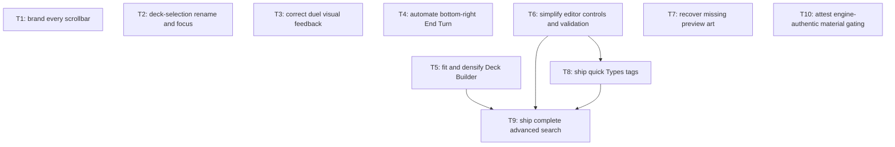

# Feedback Round 2

Implement confirmed global, Duel Field, Deck Selection, and Deck Builder feedback while preserving engine authority, Basilica Slate brand, viewport ownership, and domain boundaries.

## Scope

- S1. In: every nonblank requirement in owner input hash `36aa29ec2fe2e43d2ba416d21053c63ed77728e515bdda8742aaee89b4d3e5ce`.
- S2. In: approved advanced-search Variant A using only runtime-supported metadata.
- S3. Out: blank Right Pane, Visual Novel, Map, and Deck Selection item 4 sections.
- S4. Out: DB uniqueness, engine binary/vendor edits, fabricated material choices, story work, unrelated polish.

## Locked decisions

- D1. Types tags combine with AND; invalid or duplicate propositions never commit.
- D2. End Turn repeatedly chooses only engine-offered end-phase transitions. Non-transition decisions pause without auto-answer; same intent resumes after user response. Intent clears on opponent turn, duel result/disposal/restart, or Duel session-generation change.
- D3. Duel action controls use square corners and content-width rectangles.
- D4. Rename duplicate comparison uses exact stored-string equality after existing input trim; UI only.
- D5. Catalog name input owns Deck Builder entry focus; Advanced Search starts closed.
- D6. Material selector appears only for real engine material choices; known pinned-core auto-detach gets no fake selector.
- D7. Removed quick-filter space shows more catalog result rows.

## Assumptions

- A1. No user setup, account, key, package install, migration, or external service exists; T1 records this and starts implementation directly.
- A2. “Action buttons” means Duel card-action chips on field cards and hand zoom.
- A3. Empty Side Deck warning is removed at validation source; Side Deck overflow/errors remain.
- A4. Approved “unavailable excluded” means results exclude cards that `availableCopies(...) === 0`.
- A5. Prototype facets lacking `DeckBuilderCardView`, ruleset, or ownership data are omitted separately; set, rarity, dates, community signals, and unsupported formats are never invented.
- A6. Advanced filters live only for current Deck Builder mount; no persistence or URL state.

## Tickets Flow

## Index

| Ticket ID | Goal                                                                                                                                       | State       | Depends    | Link                                                                           |
| --------- | ------------------------------------------------------------------------------------------------------------------------------------------ | ----------- | ---------- | ------------------------------------------------------------------------------ |
| T1        | Brand every visible scrollbar without duplicating custom overlay thumbs.                                                                   | NOT STARTED | none       | [[PLAN_2026_09_04_feedback_round_2/T1_brand-every-scrollbar\|T1]]              |
| T2        | Make deck-name presses rename, focus deck filter on entry, and block exact duplicate names in UI.                                          | NOT STARTED | none       | [[PLAN_2026_09_04_feedback_round_2/T2_deck-selection-rename-and-focus\|T2]]    |
| T3        | Correct opponent hand fan, zoom halo, and Duel action-control styling.                                                                     | NOT STARTED | none       | [[PLAN_2026_09_04_feedback_round_2/T3_duel-visual-feedback\|T3]]               |
| T4        | Supersede End-control placement, move it bottom-right, and resume safe engine-offered phase exits after mandatory prompts.                 | NOT STARTED | none       | [[PLAN_2026_09_04_feedback_round_2/T4_bottom-right-end-turn\|T4]]              |
| T5        | Fit Deck Builder inside stage, reserve workspace gutter, ellipsize card names, and expand deck name.                                       | NOT STARTED | none       | [[PLAN_2026_09_04_feedback_round_2/T5_fit-and-densify-deck-builder\|T5]]       |
| T6        | Remove empty-side warning, sideboard toggle, and Deck Name label while setting catalog-name entry focus.                                   | NOT STARTED | none       | [[PLAN_2026_09_04_feedback_round_2/T6_simplify-editor-controls\|T6]]           |
| T7        | Make card preview recover after missing art and render branded placeholder.                                                                | NOT STARTED | none       | [[PLAN_2026_09_04_feedback_round_2/T7_preview-art-recovery\|T7]]               |
| T8        | Replace four quick selects and both filter labels with validated AND-combined Types tags, yielding more visible result rows.               | NOT STARTED | T6         | [[PLAN_2026_09_04_feedback_round_2/T8_quick-types-tags\|T8]]                   |
| T9        | Ship complete supported advanced search: exact overlay, live filters, unavailable-card exclusion, Name A–Z, perf, and Chromium acceptance. | NOT STARTED | T5, T6, T8 | [[PLAN_2026_09_04_feedback_round_2/T9_complete-advanced-search\|T9]]           |
| T10       | Attest real-choice material dialog gating and pinned-core Dante auto-detach negative path.                                                 | NOT STARTED | none       | [[PLAN_2026_09_04_feedback_round_2/T10_engine-authentic-material-gating\|T10]] |
