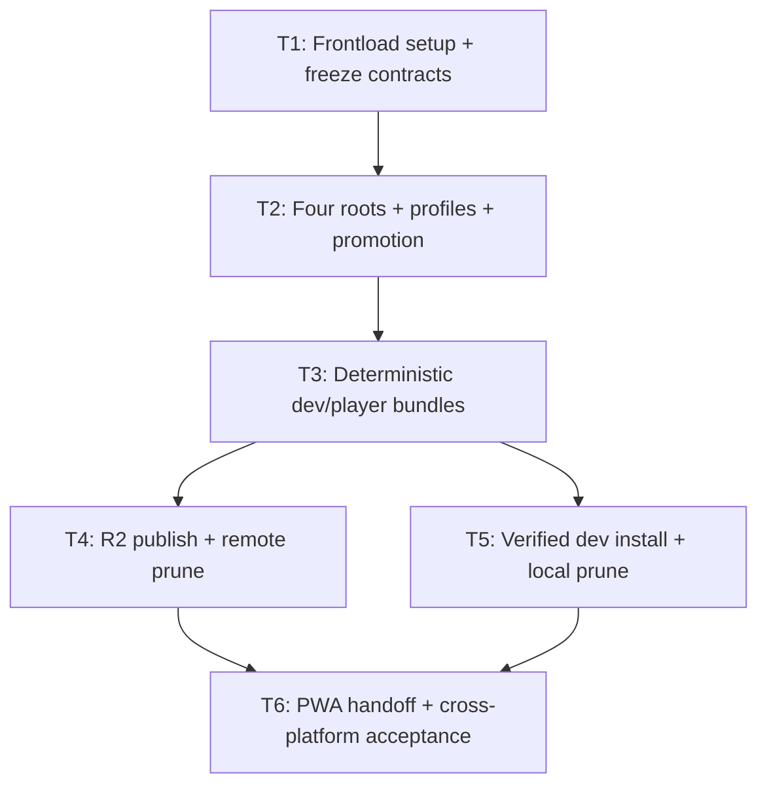

# Complete asset tooling

One verified dev download; four asset roots, deterministic profile-driven bundles, explicit R2 publication, immutable releases.

## Tickets Flow

## Index

| Ticket ID | Goal | Depends | State | Link |
| --- | --- | --- | --- | --- |
| T1 | Owner setup, typed contracts, source inventory | none | MERGED AND PUSHED | [[PLAN_2026_09_09_complete_asset_tooling/T1_setup_contracts]] |
| T2 | Four roots, profile sync, deterministic promotion | T1 | MERGED AND PUSHED | [[PLAN_2026_09_09_complete_asset_tooling/T2_asset_roots_profiles]] |
| T3 | Pure deterministic dev/player ZIP producer | T2 | MERGED AND PUSHED; BASELINE EXCEPTION APPROVED | [[PLAN_2026_09_09_complete_asset_tooling/T3_deterministic_bundles]] |
| T4 | Atomic R2 nightly/releases, explicit remote prune | T3 | NOT STARTED | [[PLAN_2026_09_09_complete_asset_tooling/T4_r2_publication]] |
| T5 | Anonymous verified dev bootstrap, safe local prune | T3 | NOT STARTED | [[PLAN_2026_09_09_complete_asset_tooling/T5_dev_bootstrap]] |
| T6 | Existing PWA handoff, CI/docs, acceptance evidence | T4, T5 | NOT STARTED | [[PLAN_2026_09_09_complete_asset_tooling/T6_integration_acceptance]] |

## Execution checkpoint — 2026-09-10

S1. T3 implementation `902fbef`, integration `aef9b00`, report checkpoint `c705d66` pushed to `origin/main`; remote SHA verified. Eight review findings independently closed; merged-main148 focused tests, typecheck, build passed.
S2. User approved the specific `FreePlayUniqueOwner.test.ts:40` baseline exception. Full suite remains failed; real large-file/platform/hosted proof remains pending, not waived.
S3. User requested pause after push. T4/T5/T6 remain NOT STARTED; no new workers, publication, or installation launched.

## Supporting documents

| ID | Link |
| --- | --- |
| S1 | [Scope, assumptions, success, baseline](PLAN_2026_09_09_complete_asset_tooling/BRIEF.md) |
| S2 | [Exact CLI/protocol contract](PLAN_2026_09_09_complete_asset_tooling/CONTRACTS.md) |
| S3 | [Exact TypeScript shapes](PLAN_2026_09_09_complete_asset_tooling/CONTRACTS.ts) |
| S4 | [PWA plan handoff/amendment](PLAN_2026_09_09_complete_asset_tooling/PWA_HANDOFF.md) |
| S5 | [Independent review/arbitration](PLAN_2026_09_09_complete_asset_tooling/REVIEW.md) |
| S6 | [Planning validation evidence](PLAN_2026_09_09_complete_asset_tooling/VALIDATION.md) |
| S7 | [Standalone visual plan](PLAN_2026_09_09_complete_asset_tooling.html) |
| S8 | [ADR-081: Asset ownership/profile selection](../docs/ADR/081_ADR_asset_roots_and_delivery_profiles.md) |
| S9 | [ADR-082: R2 publication identities](../docs/ADR/082_ADR_r2_nightly_and_immutable_asset_releases.md) |
| S10 | [ADR-083: Conflict-safe dev asset installation](../docs/ADR/083_ADR_verified_conflict_safe_dev_assets.md) |
